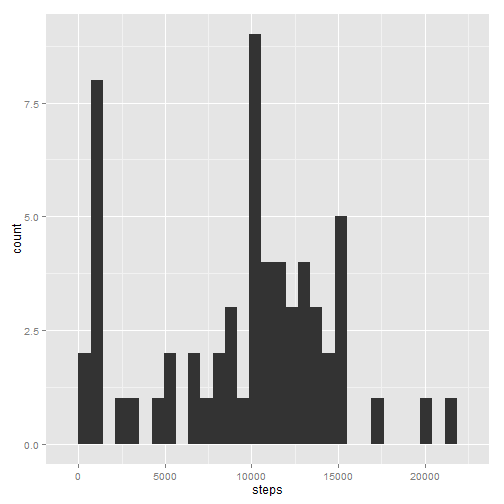
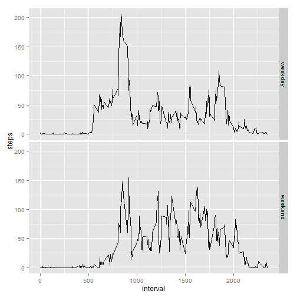

  
### Loading and preprocessing the data   
  
**1. Load the data.**  

Download the zipped file with data into the working directory and unzip it (in the same directory). I'm going to use the downloader package for it.  


```r
library(downloader)
furl <- "http://d396qusza40orc.cloudfront.net/repdata%2Fdata%2Factivity.zip"
download(furl, dest = "data.zip", mode = "wb")
unzip("data.zip")
```
  
**2. Load the data into R.**  

Also load all the needed libraries.  


```r
library(stats)
library(ggplot2)
activity <- read.csv("activity.csv")
str(activity)
```

```
## 'data.frame':	17568 obs. of  3 variables:
##  $ steps   : int  NA NA NA NA NA NA NA NA NA NA ...
##  $ date    : Factor w/ 61 levels "2012-10-01","2012-10-02",..: 1 1 1 1 1 1 1 1 1 1 ...
##  $ interval: int  0 5 10 15 20 25 30 35 40 45 ...
```
  
**3. Process the data.**  

The date variable is factor, not a date type, and have to be transformed.


```r
activity$date <- as.Date(activity$date)
str(activity)
```

```
## 'data.frame':	17568 obs. of  3 variables:
##  $ steps   : int  NA NA NA NA NA NA NA NA NA NA ...
##  $ date    : Date, format: "2012-10-01" "2012-10-01" ...
##  $ interval: int  0 5 10 15 20 25 30 35 40 45 ...
```


### What is mean total number of steps taken per day?
  
As it is stated in the assignment, I'm going to ignore NA values.  

**1. Calculate the total number of steps taken per day.**  
I'm going to create auxiliary data frame with sum of steps per day.  


```r
stepsum <- aggregate(steps ~ date, activity, sum, na.rm = TRUE)
str(stepsum)
```

```
## 'data.frame':	53 obs. of  2 variables:
##  $ date : Date, format: "2012-10-02" "2012-10-03" ...
##  $ steps: int  126 11352 12116 13294 15420 11015 12811 9900 10304 17382 ...
```
**2. Make a histogram of the total number of steps taken each day.**  
Make a histogram from *stepsum* data.  


```r
qplot(steps, data = stepsum)
```

 

**3. Calculate and report the mean and median of the total number of steps taken per day.**  
  

```r
mmean <- mean(stepsum$steps, na.rm = TRUE)
mmedian <- median(stepsum$steps, na.rm = TRUE)
```
  
Mean steps value is 1.0766189 &times; 10<sup>4</sup>.  
Median steps value is 10765.  
  

  
### What is the average daily activity pattern?  

**1. Make a time series plotof the 5-minute interval and the average number of steps taken, averaged across all days.**  

I'm going to ignore NA values as before.  

First create auxiliary data frame of average number of steps for each interval. Then make a time series plot.  

```r
intmean <- aggregate(steps ~ interval, activity, mean, na.rm = TRUE)
str(intmean)
```

```
## 'data.frame':	288 obs. of  2 variables:
##  $ interval: int  0 5 10 15 20 25 30 35 40 45 ...
##  $ steps   : num  1.717 0.3396 0.1321 0.1509 0.0755 ...
```

```r
qplot(interval, steps, data = intmean, geom = "line")
```

 


**2. Which 5-minute interval, on average across all the days in the dataset, contains the maximum number of steps?** 


```r
mint<- intmean$interval[which.max(intmean$steps)]
```

835 is here interval on average contains the maximum number of steps.  
  
  
### Imputing missing values  

There are a number of days/intervals where there are missing values (coded as NA). The presence of missing days may introduce bias into some calculations or summaries of the data.

**1. Calculate and report the total number of missing values in the dataset**  

```r
nas <- sum(is.na(activity))
```
There are 2304 rows with NAs in the dataset.  

Check what variables have NAs in them.  

```r
sum(is.na(activity$date))
```

```
## [1] 0
```

```r
sum(is.na(activity$steps))
```

```
## [1] 2304
```

```r
sum(is.na(activity$interval))
```

```
## [1] 0
```
*steps* variable has the same number of NAs as the whole dataset, and *date* and *interval* variables both have zero NAs.  

**2. Devise a strategy for filling in all of the missing values in the dataset.**  

To fill NA in particular interval I'm going to use the median across all the days for this interval.  
As the daily activity pattern plot showed, the amount of steps made changes across the day. Taking day mean (or median) can scew the data if the analysis of smaller than day intervals is needed.  
I'm going to use median and not mean because I want to replace NAs with actual observed values.   


**3. Create a new dataset that is equal to the original dataset but with the missing data filled in.** 

First I'm going to create auxiliary data frame with interval medians for each day similar to the data frame that was created in daily pattern part of the assignment.
Then I'm going to create *activity.nonas* data frame with interval median values instead of NAs.


```r
intmedian <- aggregate(steps ~ interval, activity, median, na.rm = TRUE)
activity.nonas <- activity
activity.nonas$steps <- ifelse(is.na(activity.nonas$steps),
                               intmedian$steps[match(activity.nonas$interval, intmedian$interval)],
                               activity.nonas$steps)
str(activity.nonas)
```

```
## 'data.frame':	17568 obs. of  3 variables:
##  $ steps   : int  0 0 0 0 0 0 0 0 0 0 ...
##  $ date    : Date, format: "2012-10-01" "2012-10-01" ...
##  $ interval: int  0 5 10 15 20 25 30 35 40 45 ...
```

**4. Make a histogram of the total number of steps taken each day**   

I'm going to create auxiliary data set again with sum of steps for each day.


```r
newstepsum <- aggregate(steps ~ date, activity.nonas, sum)
qplot(steps, data = newstepsum)
```

 

**Calculate and report the mean and median total number of steps taken per day.**  
Create table with mean and median of steps taken per day for dataset with NAs replaced with values and initial dataset.


```r
alldata <- data.frame("NAs ignored" = c(mean(stepsum$steps, na.rm = TRUE), median(stepsum$steps, na.rm = TRUE)), "NAs replaced" = c(mean(newstepsum$steps), median(newstepsum$steps)), row.names = c("mean", "median"))
alldata
```

```
##        NAs.ignored NAs.replaced
## mean      10766.19     9503.869
## median    10765.00    10395.000
```

It's clear that mean and median values for number of steps per day have changed with the NAs replaced with median values for interval across all days. First, both mean and median values have decreased. Second, when NAs were omitted mean and median values were almost the same (1.0766189 &times; 10<sup>4</sup> vs. 1.0765 &times; 10<sup>4</sup>) but with NAs replaced with median interval values mean and median values differ for almost 10%. I think that maybe it is a sign that the devised strategy of replacing NAs with values was not the best possible one.  


### Are there differences in activity patterns between weekdays and weekends?  

According to the task I'm going to use the dataset with the filled-in missing values for this part.  

**1. Create a new factor variable in the dataset with two levels -- “weekday” and “weekend” indicating whether a given date is a weekday or weekend day.**  

The new factor variable is named *weekday*.  
NB: I have to set locale to English because my computer OS is in another language.  


```r
Sys.setlocale("LC_TIME", "English")  
```

```
## [1] "English_United States.1252"
```

```r
activity.nonas$weekday <- ifelse(weekdays(activity.nonas$date) %in% c("Saturday", "Sunday"),
                                 "weekend", "weekday")
activity.nonas$weekday <- as.factor(activity.nonas$weekday)
```

**2. Make a panel plot containing a time series plot of the 5-minute interval and the average number of steps taken, averaged across all weekday days or weekend days.** 

I'm going to create auxiliary data frame for number of steps taken in each interval for weekday days and weekend days separately and then plot the data.


```r
wdayintmean <- aggregate(steps ~ interval + weekday, activity.nonas, mean)
qplot(interval, steps, data = wdayintmean, facets = weekday~., geom = "line")
```

 

It's clear that weekday days and weekend days differ in average number of steps taken patterns. On weekdays the activity starts earlier (number of the first peak interval is smaller) and ends earlier. Weekdays also have a large peak of number of steps around 750-ish interval which is not as prominent on weekends. On the other hand, weekends seem to be more active: there are many peaks of 100-150 steps value in comparison with weekday peaks that are of 50-100 steps value.
